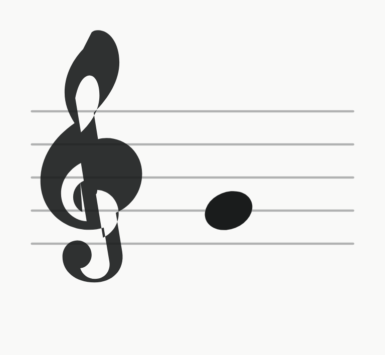
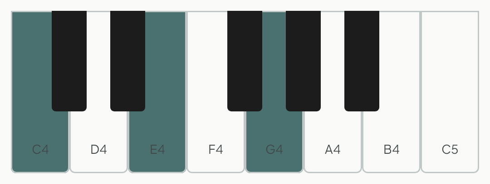
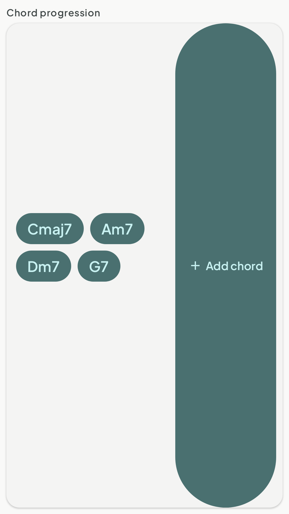

# PianoFlow Component Catalog

> Generated — do not edit by hand. Regenerate after adding/altering catalog components:
> `./gradlew :androidApp:testDebugUnitTest -Proborazzi.test.record=true`
>
> Browse interactively on a debug build via the **PianoFlow Catalog** launcher icon.

| Component | Group | Preview | Composable | Usage |
|---|---|---|---|---|
| MusicStaff | DesignSystem |  | `com.linh.pianoflow.core.designsystem.MusicStaff` | `MusicStaff(midi = 67, state = StaffNoteState.Default, space = 22.dp, width = 240.dp)` |
| PianoKeyboard | DesignSystem |  | `com.linh.pianoflow.core.designsystem.PianoKeyboard` | `PianoKeyboard(startMidi = 60, endMidi = 72, highlighted = setOf(60, 64, 67), labels = true)` |
| ChordProgressionField | Songs |  | `com.linh.pianoflow.feature.chordsmoother.impl.presentation.ChordProgressionField` | `ChordProgressionField(tokens = listOf("Cmaj7"), editingText = "", examples = emptyList(), onTokensChange = {}, onEditingTextChange = {}, onChipTap = {}, onOpenPicker = {}, onPickExample = {})` |
