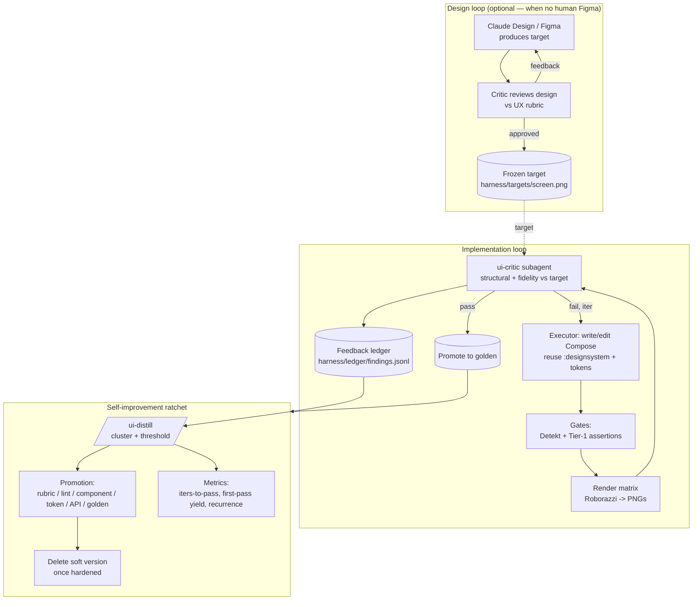

# Self-improving mobile UI harness — implementation spec

A buildable spec for a Compose Multiplatform UI development harness that lets a coding
agent (Claude Code) implement UI it can *see*, *match to a target*, and *get better at
over time*. Targets **Android + iOS, Compose Multiplatform, Material 3**, CI on **GitHub
Actions**, single developer.

The design rests on three principles established during design:

1. **Prevention over detection.** Catch errors with the cheapest, most upstream mechanism
   available. A mistake that's structurally impossible beats one caught by a gate, which
   beats one caught by a fuzzy visual review.
2. **Broken before tasteless.** Structural integrity (clipping, overlap, insets) is a hard
   gate; visual taste/fidelity is judged after structure is clean.
3. **Learnings ratchet down a durability ladder.** Every recurring finding is promoted to
   the most permanent substrate it can reach, and the soft version is then deleted.

> **Assumptions (change if wrong):** Gradle + KSP, AGP/Kotlin current, a single
> `composeApp` module plus `core/*` and `feature/*` modules, Roborazzi for headless
> rendering, Detekt for static analysis. Figma MCP and Claude Design are treated as
> *optional* target sources — the harness works without them using an absolute rubric.

---

## 1. Architecture

Two nested generator–evaluator loops, wrapped by a self-improvement ratchet.



- **Design loop** converges a *target* (only when you have no human-made Figma). Freeze it.
- **Implementation loop** makes Compose match the target (or pass the absolute rubric when
  there's no target), grounded in real renders.
- **Ratchet** turns the ledger of findings into permanent gates/components, and measures
  whether the system is actually improving.

---

## 2. Repository layout

```
project/
├── composeApp/                         # CMP app; shared UI in commonMain
│   └── src/
│       ├── commonMain/kotlin/...        # screens, feature composables
│       └── androidUnitTest/kotlin/...   # Roborazzi tests run here (JVM)
├── core/
│   ├── theme/      src/commonMain       # tokens: AppColors, AppType, Spacing, AppShapes
│   └── designsystem/ src/commonMain     # reusable components (AppButton, AppCard, ...)
├── feature/<name>/ src/commonMain       # feature screens; depend on core only
├── harness/
│   ├── goldens/<screen>@<config>.png    # committed golden images
│   ├── targets/<screen>.png             # frozen design targets (Figma / Claude Design)
│   ├── ledger/findings.jsonl            # append-only feedback ledger
│   ├── ledger/promotions.md             # proposed/approved promotions
│   └── ledger/metrics.md                # generated metrics report
├── config/detekt/detekt.yml             # static-analysis rails
├── build-logic/                         # convention plugins (render task, scan task)
├── .claude/
│   ├── skills/mobile-design/SKILL.md    # the evaluation rubric (already drafted)
│   ├── agents/ui-critic.md              # evaluator subagent
│   ├── agents/distiller.md              # ratchet subagent
│   ├── commands/ui-iterate.md           # the implementation loop
│   ├── commands/ui-distill.md           # the ratchet
│   ├── commands/ui-metrics.md           # metrics report
│   └── settings.json                    # hooks
├── COMPONENTS.md                        # generated component inventory (agent-readable)
└── CLAUDE.md                            # executor rails
```

Rule of thumb: `feature/*` may depend on `core/*` but **never** on raw `material3`
directly (enforced in §5). All reusable UI lives in `core/designsystem`.

---

## 3. Component A — the render harness (the eyes)

Headless Composable → PNG on the JVM, no emulator, via Roborazzi (Robolectric-backed).
Because the UI is shared Compose, the **Android target faithfully represents iOS** for
layout purposes; iOS gets a coarse simulator gate in CI only.

**Setup**
- Apply Roborazzi + Robolectric to `composeApp` `androidUnitTest`. Enable Robolectric
  native graphics (`GraphicsMode.NATIVE`).
- Stable output dir: configure `roborazzi.outputDir` → `harness/goldens` for record and a
  compare dir under `build/ui-shots/` for the agent to read.

**The config matrix.** Render every screen across the stress configs — most "broken" only
appears here:

| Config | How |
|---|---|
| default | Robolectric qualifier `w411dp-h891dp` |
| compact width | qualifier `w360dp-h640dp` |
| large font 1.5 / 2.0 | wrap content in `CompositionLocalProvider(LocalDensity provides Density(density, fontScale = 1.5f))` |
| dark mode | qualifier `night` + dark `AppTheme` |
| long content | inject longest-string preview state |

**Tasks** (wrap Roborazzi's real tasks behind friendly aliases in a convention plugin):
- `./gradlew recordRoborazziDebug` → writes goldens.
- `./gradlew verifyRoborazziDebug` → compares against goldens, emits diff PNGs.
- alias `./gradlew uiShots` → render current state to `build/ui-shots/<screen>@<config>.png`
  (stable paths the agent reads).

**Tier-1 deterministic assertions** (run inside the same Robolectric test, before the
screenshot — they produce precise text errors the agent can act on without vision):
- **Zero-size:** walk the semantics tree (`onAllNodes(isRoot().not())`); fail any node with
  `getUnclippedBoundsInRoot()` width or height == 0.dp that carries text/content semantics.
- **Out-of-bounds:** fail any node whose bounds exceed the root bounds (off-screen).
- **Text overflow / truncation:** route each `Text`'s `onTextLayout { it.hasVisualOverflow }`
  to a test-observable; fail if a node flagged "must not truncate" overflowed. (Tag critical
  text via a `Modifier.semantics { testTag = "noTruncate" }` convention.)
- **Touch targets:** fail clickable nodes whose bounds < 48.dp × 48.dp.
- **Insets:** assert top-level scaffold content respects `WindowInsets.statusBars` (test by
  rendering with non-zero insets and checking the app bar's top ≥ inset height).

A failing Tier-1 assertion = the screen is *broken* = stop and fix before any taste review.

**iOS gate (CI only).** A GitHub Actions job on a macOS runner boots a simulator, runs the
app, captures `xcrun simctl io booted screenshot`, and compares a small set of key screens.
Coarse, infrequent, not the iteration surface.

**Acceptance:** `uiShots` produces deterministic PNGs at stable paths for all matrix configs;
Tier-1 assertions fail a deliberately broken screen with a precise message.

---

## 4. Component B — the evaluator

**The rubric** lives in `.claude/skills/mobile-design/SKILL.md` (already drafted: Tier-1
structural blockers + Tier-2 weighted taste + anti-patterns + verdict format). Add a
**Fidelity mode** section: *when `harness/targets/<screen>.png` exists, the taste axis becomes
"match the target" — report per-element deltas (spacing, color, type, size, component identity)
instead of absolute taste judgments; otherwise fall back to the absolute Tier-2 rubric.*

**The critic subagent** — `.claude/agents/ui-critic.md`:

```markdown
---
name: ui-critic
description: Evaluates rendered mobile UI screenshots against the mobile-design rubric and
  an optional design target. Use in the UI iteration loop after every render.
tools: Read, Bash, Grep
model: inherit
---
You are a mobile UI evaluator. You judge ONLY what is rendered, never intent.

Inputs you are given: paths to render PNGs (build/ui-shots/*), an optional target
(harness/targets/<screen>.png), and the mobile-design skill rubric.

Procedure:
1. Load the mobile-design rubric.
2. For each matrix config, run the two passes: Tier-1 structural (blockers), then Tier-2
   (taste, or fidelity-vs-target if a target exists). For fidelity, compare render | target
   side by side and list concrete deltas.
3. Output the verdict in the rubric's exact format.
4. Append one JSON line per finding to harness/ledger/findings.jsonl (schema in the spec).

You never edit code. You only judge and log. Run in a fresh context — you do not see the
executor's reasoning, only the artifacts.
```

Running the critic in its **own context** is deliberate: it prevents the executor's
rationalizations from anchoring the judgment (the correlated-critic failure mode).

**Acceptance:** given a broken render the critic returns `fail` with element-level Tier-1
findings; given a target it reports measurable deltas; every finding lands in the ledger.

---

## 5. Component C — the executor + prevention rails

The executor is Claude Code itself, constrained so reinvention and off-theme values are hard.

**`CLAUDE.md` rails** (excerpt):

```markdown
## UI implementation rules
- Before writing any UI, consult COMPONENTS.md and core/designsystem. Reuse what fits.
- Never import androidx.compose.material3.* from feature/* — use core/designsystem wrappers.
- Never hardcode color, size, or text style. Use AppColors / Spacing / AppType / AppShapes.
- Top-level screens must consume WindowInsets (status bars, nav bars, IME).
- If nothing fits, create the component IN core/designsystem with an @Preview, then use it.
- After ANY UI change, run `/ui-iterate <screen>` and do not declare done until it passes.
```

**Detekt forbidden-import rail** — `config/detekt/detekt.yml`:

```yaml
style:
  ForbiddenImport:
    active: true
    imports:
      - value: 'androidx.compose.material3.**'
        reason: 'Use core/designsystem wrappers, not raw Material3, in feature code.'
# Exclude core/designsystem from this rule via a module-scoped detekt config or
# a baseline so the wrappers themselves may import material3.
```

Add custom/3rd-party Compose rules (e.g. Slack `compose-lints`) for modifier-order and
missing-modifier issues. Optionally a rule banning literal `Color(0xFF...)` and bare `.dp`
outside `core/theme`.

**Component manifest** — `COMPONENTS.md`, generated by a Gradle task that scans
`core/designsystem` for public `@Composable` functions and emits `name + signature +
one-line KDoc summary`. Run it in the convention plugin (or via KSP / Showkase metadata on
the Android target). This is the agent-readable inventory that powers reuse.

**Code Connect (optional, if Figma).** Annotate `core/designsystem` components with
`@FigmaConnect`, publish via the Code Connect CLI on the Android source set. Then
`get_code_connect_map` returns your `AppButton` for a Figma node — reuse made precise.

**Acceptance:** a feature file importing `material3.Button` fails Detekt; `COMPONENTS.md`
regenerates on demand and lists every design-system component.

---

## 6. Component D — the design-target pipeline (optional)

Produces the frozen target the fidelity loop matches against. Two sources:

**Figma MCP.** `get_variable_defs` → sync tokens into `core/theme` (generate
`AppColors/AppType/Spacing` from variables; Figma can emit Compose-format names).
`get_screenshot` of each frame → `harness/targets/<screen>.png`. `get_design_context` →
spacing/size spec. Ignore `get_code` (web-biased); consume spec + image only.

**Claude Design.** Feed it `core/designsystem` + tokens so it designs with parts that exist.
Run the **design loop** (generate → critic reviews design vs UX rubric → feedback → update)
until approved, then export each screen image → `harness/targets/<screen>.png` and **freeze**.

> Open integration question to verify at build time: whether Claude Design can be driven
> programmatically by Claude Code, or whether the design-loop hand-off is manual (critic
> emits structured feedback, you paste it in). Architect the freeze step the same either way.

**Acceptance:** tokens in `core/theme` trace to design variables; each target screen has a
frozen PNG under `harness/targets/`.

---

## 7. Component E — the self-improvement ratchet (the heart of this request)

Turns the ephemeral ledger into permanent gates, components, and structure.

**Ledger schema** — `harness/ledger/findings.jsonl`, one JSON object per finding:

```json
{
  "ts": "2026-06-18T10:00:00Z",
  "screen": "LoginScreen",
  "config": "fontScale1.5",
  "loop": "impl",
  "role": "evaluator",
  "tier": 1,
  "category": "insets",
  "severity": "blocker",
  "element": "TopAppBar title",
  "finding": "App bar overlaps status bar",
  "fix": "apply Modifier.windowInsetsPadding(WindowInsets.statusBars)",
  "iteration": 2,
  "resolved": false,
  "deposit": null
}
```

`category` is a controlled vocabulary (`insets, overflow, truncation, overlap, zero-size,
touch-target, spacing, hierarchy, color, typography, reuse, fidelity, ...`). `deposit` is set
when a learning is promoted.

**The distill step** — `/ui-distill` + `distiller` subagent:
1. Read the ledger; cluster unresolved/recurring findings by `category` (and by `fix` shape).
2. Apply the **promotion threshold** (default: a category seen **≥ 3 times** across screens
   is a pattern, not a one-off).
3. For each over-threshold cluster, choose a **deposit target** from the policy table below
   and write a proposal to `harness/ledger/promotions.md`.
4. Human approves (required for Tier-2/3 — lint rules, components, API changes).
5. On approval, implement the promotion, set `deposit` on the ledger entries, and **delete
   the now-redundant soft guidance** (e.g. remove the rubric line once a lint rule enforces it).

**Promotion policy (durability ladder).** Push each learning as far down as it can go:

| Finding category | Target tier | Concrete deposit |
|---|---|---|
| insets, overflow, zero-size, out-of-bounds, touch-target | T2 gate | new Tier-1 **assertion** in the Roborazzi test |
| raw material3 used, hardcoded color/dp | T3 structural | tighten **module boundary** + Detekt rule; eventually unreachable |
| recurring component reinvented | T3 structural | promote a **component** into `core/designsystem` + Code Connect + golden |
| spacing / hierarchy that *is* measurable | T2 gate | lint/assertion on the measurable part |
| pure taste (not mechanizable) | T1 soft | a **rubric line** in mobile-design (kept minimal) |
| any category, once enforced upstream | — | **delete** the rubric/CLAUDE.md line; it's redundant |

The end state of a mature category: evaluator judgment → lint gate → structurally impossible
→ soft guidance deleted. **A healthy harness's soft guidance shrinks over time.**

**Golden corpus.** Every passing screen's render is promoted to `harness/goldens/`. Future
changes diff against it free. Provide a cheap `./gradlew recordRoborazziDebug` path to accept
an *intentional* redesign so the net doesn't fight deliberate change.

**Acceptance:** seeding the ledger with 3 `insets` findings makes `/ui-distill` propose a new
inset assertion; approving it adds the assertion and removes the corresponding rubric line.

---

## 8. Component F — metrics (prove it's compounding)

`/ui-metrics` computes from the ledger into `harness/ledger/metrics.md`:

- **Iterations-to-pass** per screen = max `iteration` before all findings `resolved`. Trend ↓.
- **First-pass yield** = screens with zero Tier-1 findings at `iteration == 1` ÷ total. Trend ↑.
- **Per-category recurrence** = findings in a category *after* its first `deposit`. Should
  approach 0; if it doesn't, the promotion didn't stick → move it down a tier.

Recurrence is also the promotion *signal*: a category still recurring after a rubric line
existed is the cue to harden it into a gate.

**Acceptance:** metrics report renders the three numbers and flags any category whose
recurrence rose after a promotion.

---

## 9. The orchestration loop

`.claude/commands/ui-iterate.md` (`$1` = screen):

```markdown
---
description: Implement/repair a screen until it passes structural + fidelity gates.
argument-hint: <ScreenName>
allowed-tools: Read, Edit, Write, Bash, Grep, Task
---
Iterate on $1 until it passes. Max 4 iterations, then escalate to the human.

1. Resolve the target: harness/targets/$1.png if present, else use absolute rubric mode.
2. Implement/edit $1 in Compose. Reuse core/designsystem (check COMPONENTS.md); use tokens;
   handle insets. Never import material3 in feature code.
3. Gates: run `./gradlew detekt` then the Tier-1 Roborazzi assertions. On failure, fix and
   repeat step 2 (these are deterministic and cheap — clear them before rendering for taste).
4. Render: `./gradlew uiShots` → build/ui-shots/$1@*.png.
5. Evaluate: launch the `ui-critic` subagent with the render paths + target + rubric.
   It returns a verdict and appends findings to the ledger.
6. If `pass`: `./gradlew recordRoborazziDebug` to promote goldens; mark ledger findings
   resolved; stop. If `fail` and iteration < 4: feed findings to step 2. Else escalate.

Stop conditions: Tier-1 clean AND (fidelity diff < tolerance OR rubric pass).
```

`.claude/settings.json` hooks (keep heavy work in the command, only fast checks in hooks):

```json
{
  "hooks": {
    "PostToolUse": [
      {
        "matcher": "Edit|Write",
        "hooks": [
          { "type": "command",
            "command": "if echo \"$CLAUDE_FILE_PATHS\" | grep -q '\\.kt$'; then ./gradlew detekt -q || echo 'Detekt failed — fix before continuing'; fi" }
        ]
      }
    ]
  }
}
```

(Detekt is fast enough for a per-edit hook; Roborazzi rendering is not — it stays in
`/ui-iterate`.)

---

## 10. Build phases & milestones

Build prevention first, then eyes, then the loop, then self-improvement. Each phase is
independently useful.

| Phase | Deliver | Acceptance |
|---|---|---|
| **0 — Rails** | module boundaries, `core/theme` tokens, `core/designsystem` skeleton, `CLAUDE.md`, Detekt forbidden-import, `COMPONENTS.md` generator | feature file importing material3 fails Detekt; manifest lists components |
| **1 — Eyes** | Roborazzi + config matrix + stable paths + Tier-1 assertions + first goldens | `uiShots` deterministic; broken screen fails an assertion with a precise message |
| **2 — Loop** | `mobile-design` Fidelity mode, `ui-critic` subagent, `/ui-iterate` | a broken screen is auto-detected, fixed, and re-passes within ≤4 iterations |
| **3 — Self-improvement** | ledger, `/ui-distill` + promotion policy, golden corpus, `/ui-metrics` | 3 seeded findings → proposed promotion; metrics report renders the 3 numbers |
| **4 — Targets (optional)** | Figma MCP token sync + Code Connect, or Claude Design design loop + frozen targets | tokens trace to variables; each screen has a frozen target; fidelity deltas reported |

---

## 11. Risks & mitigations (carried from design)

- **Correlated critic** (executor & evaluator share blind spots) → critic judges *rendered*
  artifacts against an explicit rubric in a *fresh context*; you spot-check periodically.
- **Soft-guidance bloat** → the promote-and-delete ratchet; `CLAUDE.md`/rubric are a staging
  area, not storage.
- **Golden ossification** → cheap "accept new golden" path for intentional redesigns.
- **Reward hacking the gates** → keep a non-mechanized taste layer (vision critic + you) for
  what lint can't express.
- **iOS divergence** → Android render catches layout for both; simulator gate catches the
  iOS-specific residual in CI.
- **Loop non-convergence** → hard cap of 4 iterations, critic returns only blocking deltas,
  explicit stop conditions, human escalation.

---

## 12. First commit checklist

1. Create modules and the `harness/` + `.claude/` trees (§2).
2. Land Phase 0 rails; confirm Detekt fails on a planted `material3` import.
3. Wire Roborazzi; render one real screen across the matrix; commit its goldens.
4. Add the `ui-critic` subagent and `/ui-iterate`; run it on one deliberately-ugly screen.
5. Start the ledger; after ~10 screens, run `/ui-distill` and make your first promotion.
6. Track the three metrics from day one so the improvement curve is visible.
